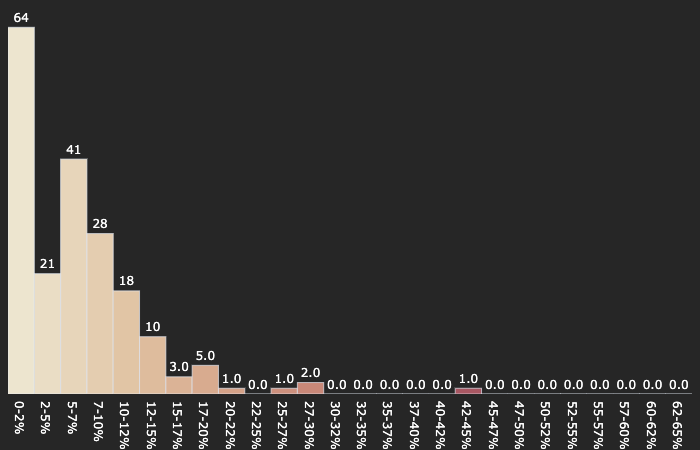
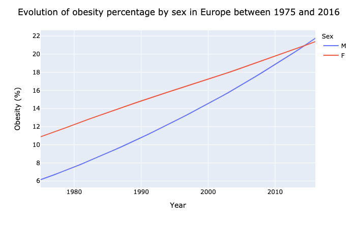
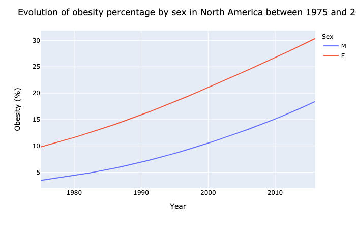
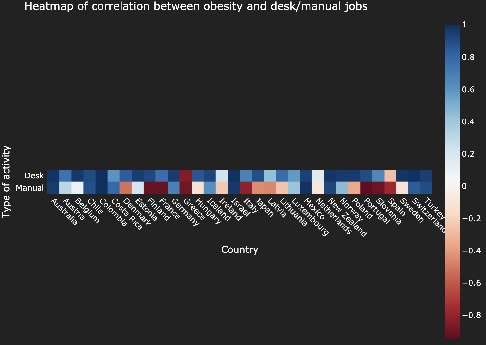

# Introduction


> source: [ici](https://upload.wikimedia.org/wikipedia/commons/f/f8/Python_logo_and_wordmark.svg)

Dans le cadre du module "*Python pour la datascience*" (**DSIA-4101A**), nous avons eu l'opportunité de créer un dashboard liant les compétences acquises grâce ce module avec notre créativité. Le projet se réalisa en binôme et l'objectif fut de fournir une représentation intéractive (dashboard) d'un jeu de données accessibles publiquement et non modifiées.  

Notre responsable:
- **COURIVAUD Daniel**

Notre binôme est composé de:
- **RAFIDINARIVO Itokiana**
- **FONTA Romain**
  
Et nos jeux de données sont:
- *[Obesity among adults by country, 1975-2016](https://www.kaggle.com/amanarora/obesity-among-adults-by-country-19752016)*
  > *source: Kaggle*
- *[Employment by activities (ISIC Rev.4)](https://stats.oecd.org/Index.aspx?QueryId=3491)*
  > *source: OECD Stats*

#### Problématique
Alors notre binôme s'est demandé: <ins>*Existe t'il un lien entre l'obesité et les emplois bureautiques <sup>et</sup>/<sub>ou</sub> manuels?*</ins>

<br>
<br>

# Table des matières

## I. Guide utilisateur

### 1. Installation

#### A. Python (3.X.X)
Dans un premier temps, afin d'utiliser notre projet il faudra posséder ***Python v3.X.X*** sur votre appareil. Pour cela, que votre appareil soit sous Linux, macOS, Windows ou autre, rendez vous la page de téléchargement de Python en cliquant [ici](https://www.python.org/downloads/). Puis suivez les instructions lors de l'installation.

Après l'installation, vérifiez que ***Python v3.X.X*** est bien installé sur votre appareil en tapant les commandes suivantes sur le Terminal, Invité de commandes, PowerShell ou autre selon votre système d'exploitation:

```bash
$ python3 --version
Python 3.X.X
```

Ou
```bash
$ python --version
Python 3.X.X
```

Dans le cas où vous avez ce résultat:
```bash
Python 2.X.X
```
Alors reinstallez une version 3.X.X de Python.

#### B. Windows

#### C. Linux & macOS
Lancez un terminal/invité de commandes/console au niveau du projet:
```bash
$ cd [Le chemin menant au dossier]/Projet
$ ls
README.md     app.py     data     src
```
Il faudra bien-sûr remplacer le "*[Le chemin menant au dossier]*" par le chemin réel sur votre appareil. Si vous ne vous retrouvez pas avec le même affichage alors vérifiez si vous êtes bien dans le bon dossier ou non sinon jusqu'à là c'est bon.  

Une fois que vous avez le même affichage, lancez une des commandes suivantes afin de lancer l'application:
```bash
$ python3 app.py
```
Ou
```bash
$ python app.py
```

Si tout se passe bien alors vous aurez cette affichage:
```bash
$ python3 app.py
Dash is running on http://127.0.0.1:8050/

 * Serving Flask app "app" (lazy loading)
 * Environment: production
   WARNING: This is a development server. Do not use it in a production deployment.
   Use a production WSGI server instead.
 * Debug mode: on
```

### 2. Utilisation

## II. Guide développeur

## III. Rapport d'analyse

### 1. Les données

#### A. Obesity among adults by country, 1975-2016

Ce jeu de données provient de *[Kaggle](https://www.kaggle.com/amanarora/obesity-among-adults-by-country-19752016)*, une communauté regroupant des outils et des ressources pour la data science, précisément celui-ci a été modifié par l'utilisateur *[Aman Arora](https://www.kaggle.com/amanarora)* à partir des données originales se trouvant [ici](https://apps.who.int/gho/data/node.main.A900A?lang=en) sur le site l'*Organisation Mondiale de la Santé (OMS)*.
  
Dans ce jeu de données on retrouve le pourcentage de personnes obèses, pour les hommes/femmes/les deux, au sein d'un pays pour une année spécifique. Celui-ci est composé de **24 570 enregistrements/lignes** et de **8 variables**.

  
Voici la structure du jeu de données post-traitement:

<br>

| Variables | Type | Description |
|:-----------:|:-----------:|:-----------|
| **country** | Categoriel (nominal) | *Le pays* |
| **country_code** | Categoriel (nominal) | *Le code du pays en format ISO3* |
| **continent** | Categoriel (nominal) | *Le continent, associé au **country*** |
| **year** | Numérique (ratio) | *L'année* |
| **sex** | Categoriel binaire (nominal) | *Le sexe, on ne prend en compte que l'homme ou la femme* |
| **obesity** | Numérique (ratio) | *L'obesité moyenne en pourcentage pour un pays et un sexe donné* |
| **max_obesity** | Numérique (ratio) | *La valeure minimale en pourcentage de l'obesité* |
| **min_obesity** | Numérique (ratio) | *La valeure maximale en pourcentage de l'obesité* |

<ins>Remarques :</ins>
- On ne travaille pas avec les variables **max_obesity** et  **min_obesity**, ceux-ci ont été gardées au cas où elles deviendraient utiles à autrui ultérieurement.
- La variable **country_code** sert pour le graphique géolocalisé, on utilise un jeu de données complémentaire afin d'obtenir les coordonnées géographiques de chaque pays.

<br>

#### B. Employment by activities (ISIC Rev.4)

Ce jeu de données provient de *[OECD (Organisation for Economic Co-operation and Development)](https://stats.oecd.org/Index.aspx?QueryId=3491)*, une organisation économique intergouvernementale composée de 37 pays fondée en 1961 (*Wikipedia*) dans le but de stimuler la progression économique et les échanges.
  
Dans ce jeu de données on retrouve le nombre d'employés selon des activités économiques. Ces activités économiques sont définies par l'*International Standard Industrial Classification (ISIC) Revision 4*, on y retrouve les activités suivantes:

1. Agriculture, forestry and fishing
1. Mining and quarrying
2. Manufacturing
3. Electricity, gas, steam and air conditioning supply
4. Water supply; sewerage, waste management and remediation activities
5. Construction
6. Wholesale and retail trade; repair of motor vehicles and motorcycles
7. Transportation and storage
8. Accommodation and food service activities
9.  Information and communication
10. Financial and insurance activities
11. Real estate activities
12. Professional, scientific and technical activities
13. Administrative and support service activities
14. Public administration and defence; compulsory social security
15. Education
16. Human health and social work activities
17. Arts, entertainment and recreation
18. Other service activities
19. Activities of households as employers; undifferentiated goods- and services-producing activities of households for own use
20. Activities of extraterritorial organizations and bodies

Voici la structure du jeu de données post-traitement:

<br>

| Variables | Type | Description |
|:-----------:|:-----------:|:-----------|
| **country** | Categoriel (nominal) | *Le pays* |
| **country_code** | Categoriel (nominal) | *Le code du pays en format ISO3* |
| **continent** | Categoriel (nominal) | *Le continent, associé au pays* |
| **sex** | Categoriel binaire (nominal) | *Le sexe, on ne prend en compte que l'homme ou la femme* |
| **year** | Numérique (ratio) | *L'année* |
| **subject** | Categoriel (nominal) | *L'activité économique (listées au-dessus)* |
| **activity** | Categoriel binaire (nominal) | *Le type d'emploi, soit bureautique, soit manuel* |
| **value** | Numérique (ratio) | *Le nombre d'employés dans le secteur, associé à un secteur/année/pays* |

<ins>Remarques :</ins>
- La création de la variable **activity** a été faite manuellement à partir de la variable **subject** donc celle-ci reste subjective à notre binôme.

<br>

### 2. Observations

Maintenant analysons les jeux de données sur l'obésité et l'emploi afin de répondre à notre problématique.

#### A. Obesity among adults by country, 1975-2016 

- ##### Cartographie & Distribution

| 1975 | 1996 | 2016 |
|:-----------:|:-----------:|:-----------:|
|||
||| 

- On observe plusieurs choses avec ces cartes et histogrammes:
  - Les **pays les moins développés** sont ceux qui possèdent une **croissance faible même quasi nulle du pourcentage d'obesité**.  
  - Les **pays les plus développées/riches** et les **pays en voie de développement** possèdent une croissance un peu plus élevée du pourcentage d'obésité.
  - Un pays a réussi à avoir une majorité de sa population en obésité (*Nauru*).

- ##### Analyse spacio-temporelle

<ins>Selon les continents:</ins>
  


- On observe plusieurs choses avec ce graphique:
  - **Dans chaque continent** le pourcentage d'obesité au sein de la population ne fait **que augmenter**.
  - Le continent avec me pourcentage d'obésité le plus élevé est l'**Océanie**.
  - Le continent avec le pourcentage d'obésité le plus faible est l'**Afrique**.

- <ins>Critiques:</ins>
  - Le calcul du pourcentage d'obésité par continent s'est fait par le calcul des moyennes d'obésité de chaque pays du continent sans prendre en compte le coefficient de population par pays, donc les résultats ne sont pas à 100% représentatifs de la réalité. 

<ins>Selon les continents et le sexe:</ins>

| Continent | Graphique |
|:---:|:---:|
| Asie |  |
| Europe |  |
| Amerique du nord |  |
| Amerique du sud |  |
| Océanie |  |

- On observe plusieurs choses avec ce graphique:
  - Dans tout les continents, peut importe le sexe, **la tendance pour le pourcentage de l'obésité est d'augmenter**.
  - Dans la majorité des continents **le pourcentage de femmes obèses est toujours plus élevé que les hommes**.
  - **L'Europe est le seul continent qui a inversé la position des courbes des hommes et des femmes**. Donc à partir d'une certaine année le pourcentage d'hommes obèses est devenu plus élevé que celui des femmes obèses.

- <ins>Critiques:</ins>
  - On retouve ici le même problème que le graphique précédent puisqu'on n'utilise pas le coefficient de la population pour le calcul de la moyenne d'obésité.

- ##### Bilan

A partir de toutes ces observations on peut conclure que l'obésité est une maladie qui touche le monde entier cependant certains sont plus touchés que d'autres, notamment les pays riches et  les plus développés à quelques exceptions près. En plus de cela, les femmes sont plus touchées que les hommes par cette maladie en général cependant on observe une transition de cette tendance en Europe. Malheureusement **l'obésité peut être décrite comme une fonction croissante par rapport au temps**, c'est-à-dire que le pourcentage de personnes obèses ne fait qu'augmenter.

#### B. Employment by activities (ISIC Rev.4)

- ##### Analyse spacio-temporelle
- ##### Bilan

#### C. Comparaison des jeux de données

Nos deux jeux de données nous ont appris beaucoup de choses, cependant il serait intéressant de conclure sur notre problématique en faisant des opérations entre  elles.

- ##### Contraintes

Malgré le fait que nos jeux de données soient chacunes assez complètes, elles ne proviennent pas de la même sources. Donc la fusion des jeux de données limites les comparaisons sur **15 164 enregistrement/lignes** dont **32 pays** répartis sur **les années [2008;2016]**.

- ##### Correlation


- <ins>Explication du graphique:</ins>
  - En abscisse, les pays
  - En ordonnée, le type d'activité (*Desk: Bureautique, Manual: Manuel*)
  - Les carrés représentent la correlation entre l'obésité et le nombre d'employés dans le type d'activité. La couleur des carrés est interprété de la manière suivante:
    - Plus le carré se rapproche du **<span style="color:blue">bleu</span>**, donc de la valeur **<span style="color:blue">1</span>**, alors correlation est positive. Cela signifie que **<span style="color:blue">l'obésité et le type d'activité peuvent être représentés par une fonction croissante</span>**.
    - Plus le carré se rapproche du **<span style="color:red">rouge</span>**, donc de la valeur **<span style="color:red">-1</span>**, alors correlation est positive. Cela signifie que **<span style="color:red">l'obésité et le type d'activités peuvent être représenté par une fonction décroissante</span>**.
  - Par exemple pour la France:
    - **Desk/Obesity** en bleu implique que **<span style="color:blue">le pourcentage d'obesité augmente lorsque le nombre d'employés dans les bureaux augmente</span>**.
    - **Manual/Obesity** en rouge implique que **<span style="color:red">le pourcentage d'obesité baisse lorsque le nombre d'employés travaillant manuellement augmente</span>**.
  
<br>

- <ins>Observations:</ins>
  - **<span style="color:blue">Desk</span> <span style="color:red">Manual</span>**: <b>14 pays</b> (*Denmark, Finland, France, Hungary, Ireland, Italy, Japan, Latvia, Lithuania, Netherlands, Poland, Portugal, Slovenia, Sweden*)
  - **<span style="color:blue">Desk</span> <span style="color:blue">Manual</span>**: <b>16 pays</b> (*Australia, Austria, Belgium, Chile, Colombia, Costa Rica, Estonia, Germany, Iceland, Israel, Luxembourg, Mexico, New Zealand, Norway, Switzerland, Turkey*)
  - **<span style="color:red">Desk</span> <span style="color:red">Manual</span>**: <b>2 pays</b> (*Greece, Spain*)
- <ins>Hypothèses:</ins>
  - Pour les pays en **<span style="color:blue">Desk</span> <span style="color:red">Manual</span>** sont les pays qui ont tendance à moins recruter dans les métiers manuels mais plus dans les métiers bureautiques.
  -  Pour les pays en **<span style="color:blue">Desk</span> <span style="color:blue">Manual</span>** sont les pays qui recrutent dans les métiers manuels et bureautiques.
  - Pour les pays en **<span style="color:red">Desk</span> <span style="color:red">Manual</span>** sont les pays qui sont possiblement en crise.

<br>

- **Bilan**
  
En combinant nos jeux de données, on a découvert **3 groupes de pays qui présentent des comportements similaires** grâce à la correlation entre l'obésité et l'emploi dans les activités manuelles/bureautiques.

### 3. Conclusion


