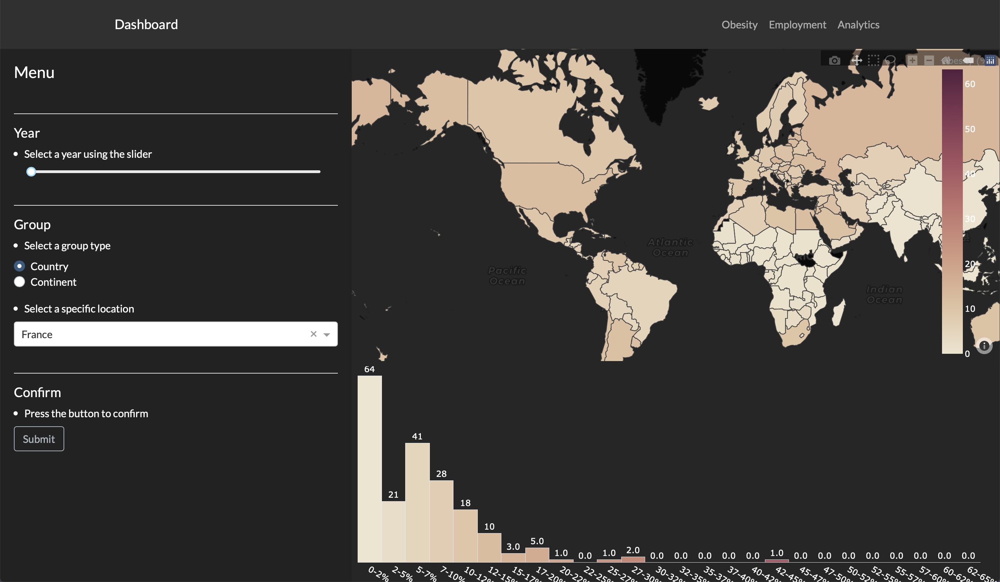
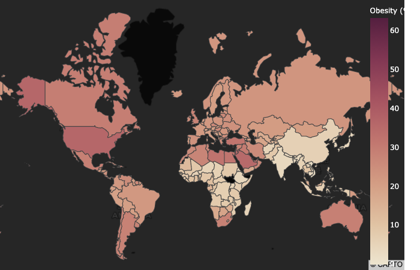
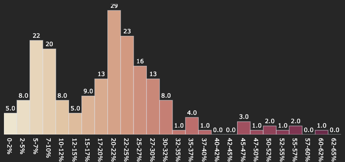

# Introduction


> sources: [python](https://upload.wikimedia.org/wikipedia/commons/f/f8/Python_logo_and_wordmark.svg), [ESIEE Paris](https://upload.wikimedia.org/wikipedia/fr/7/71/Logo_ESIEE_Paris.svg)

Dans le cadre du module "*Python pour la datascience*" (**DSIA-4101A**), nous avons eu l'opportunité de créer un dashboard liant les compétences acquises grâce ce module avec notre créativité. Le projet se réalisa en binôme et l'objectif fut de fournir une représentation intéractive (dashboard) d'un jeu de données accessibles publiquement et non modifiées.  

Notre responsable:
- **COURIVAUD Daniel**

Notre binôme est composé de:
- **RAFIDINARIVO Itokiana**
- **FONTA Romain**
  
Et nos jeux de données sont:
- *[Obesity among adults by country, 1975-2016](https://www.kaggle.com/amanarora/obesity-among-adults-by-country-19752016)*
  > *source: Kaggle*
- *[Employment by activities (ISIC Rev.4)](https://stats.oecd.org/Index.aspx?QueryId=3491)*
  > *source: OECD Stats*

#### Problématique
Alors notre binôme s'est demandé: <ins>*Existe t'il un lien entre l'obesité et les emplois bureautiques <sup>et</sup>/<sub>ou</sub> manuels?*</ins>

<br>

___

# Table des matières

[[_TOC_]]
___


# I. Guide utilisateur

## 1. Installation & Téléchargement

### A. Python (3.X.X)
Dans un premier temps, afin d'utiliser notre projet il faudra posséder ***Python v3.X.X*** sur votre appareil. Pour cela, que votre appareil soit sous Linux, macOS, Windows ou autre, rendez vous la page de téléchargement de Python en cliquant [ici](https://www.python.org/downloads/). Puis suivez les instructions lors de l'installation.

Après l'installation, vérifiez que ***Python v3.X.X*** est bien installé sur votre appareil en tapant les commandes suivantes sur le Terminal, Invité de commandes, PowerShell ou autre selon votre système d'exploitation:

```bash
$ python3 --version
Python 3.X.X
```

Ou
```bash
$ python --version
Python 3.X.X
```

Dans le cas où vous avez ce résultat:
```bash
Python 2.X.X
```
Alors reinstallez une version 3.X.X de Python.

### B. *pip*/*pip3*

Dans un second temps, installer Python ne suffit pas. Le projet utilise différents "*packages*" qui ne sont pas disponibles automatiquement avec ***Python*** alors il faudra installer *pip*.

*pip* n'a pas besoin d'être installé si la version est:
- Python 2.X.X >= **2.7.9**
- Python 3.X.X >= **3.4**

Sinon voici un lien pour le télécharger [ici](https://pip.pypa.io/en/stable/installing/).

### C. Le dashboard

#### Télécharger le projet

Le projet est téléchargeable sur le la page suivante [ici](https://git.esiee.fr/rafidini/dsia-4101a). Celui-ci pourra être utilisé comme un "Git Repository", en "*forkant*" le projet, ou comme un projet dossier normal, en "*clonant*" le projet sur votre ordinateur.

#### Packages nécessaires

Pour que le projet marche comme il faut, des packages supplémentaires sont nécessaires. Le nom de ces packages sont disponibles dans le fichier *requirements.txt*:

```bash
...
dash==1.16.0
dash-bootstrap-components==0.10.6
dash-core-components==1.12.0
dash-html-components==1.1.1
dash-renderer==1.8.0
dash-table==4.10.1
decorator==4.4.2
defusedxml==0.6.0
descartes==1.1.0
entrypoints==0.3
...
```

Afin de les télécharger/installer voici les commandes possibles en fonction de votre configuration:

```bash
pip install -r requirements.txt
```

```bash
pip3 install -r requirements.txt
```

```bash
python -m pip install -r requirements.txt
```

```bash
python3 -m pip install -r requirements.txt
```

## 2. Exécution

### A. Windows

Lancez un invité de commande/cmd/powershell puis rendez-vous au niveau du dossier du projet:

- Sous CMD
```shell
> CD [Le chemin menant au dossier]
> DIR
...
```

- Sous powershell
```shell
> cd [Le chemin menant au dossier]
> ls
README.md     app.py     data     src
requirements.txt
```

Il faudra bien-sûr remplacer le "*[Le chemin menant au dossier]*" par le chemin réel sur votre appareil. Si vous ne vous retrouvez pas avec un affichage a peu près similaire alors vérifiez si vous êtes bien dans le bon dossier ou non sinon jusqu'à là c'est bon.  

Une fois que vous avez le même affichage, lancez une des commandes suivantes afin de lancer l'application:

### B. Linux & macOS
Lancez un terminal/invité de commandes/console au niveau du projet:
```bash
$ cd [Le chemin menant au dossier]
$ ls
README.md     app.py     data     src
requirements.txt
```
Il faudra bien-sûr remplacer le "*[Le chemin menant au dossier]*" par le chemin réel sur votre appareil. Si vous ne vous retrouvez pas avec le même affichage alors vérifiez si vous êtes bien dans le bon dossier ou non sinon jusqu'à là c'est bon.  

Une fois que vous avez le même affichage, lancez une des commandes suivantes afin de lancer l'application:
```bash
$ python3 app.py
```
Ou
```bash
$ python app.py
```

Si tout se passe bien alors vous aurez cette affichage:
```bash
$ python3 app.py
Dash is running on http://127.0.0.1:8050/

 * Serving Flask app "app" (lazy loading)
 * Environment: production
   WARNING: This is a development server. Do not use it in a production deployment.
   Use a production WSGI server instead.
 * Debug mode: on
```

## 3. Utilisation

Une fois éxécuté, le "*dashboard*" est accessible à l'adresse [http://127.0.0.1:8050/](http://127.0.0.1:8050/).

### A. Bar de navigation


Pour d'accéder aux différentes pages proposées par l'application il y a la bar de navigation (ci-dessus). L'application propose 3 pages:
- *Obesity*
- *Employment*
- *Analytics*
Tous sont accessibles en cliquant sur le label correspondant à la page à droite de la bar de navigation.

### B. Page *Obesity*

Lorsque l'installation et l'éxecution ont bien été respéctés alors on se retrouve sur la page suivante:  



Sur cette page, *Obesity*,  on utilise le jeu de données *Obesity among adults by country, 1975-2016*.

- #### Fenêtre principale


La page permet d'intéragir avec la carte du monde et l'histogramme situés du côté droit de la page à partir du "*slider*" situé en haut à gauche afin de défiler les années. Cela permet de voir la progression du pourcentage d'obesité sur une représentation géolocalisée et la distribution de celle-ci au cours des années. 

- #### Fenêtre secondaire

La fenêtre secondaire est une fenêtre sur laquelle on peut avoir plus d'information sur une région spécifique, c'est-à-dire un pays ou un continent. Celle-ci apparaît lorsque que l'on appuie sur le bouton "*Submit*" après avoir choisi la région ou lorsque l'on change de pays/continent. Voici deux examples:


> Apparition de la fenêtre secondaire pour un pays spécifique

<br>

 
> Apparition de la fenêtre secondaire pour un continent spécifique

<br>

**Mais ducoup qu'est-ce que l'on peut faire sur cette fenêtre secondaire?**
- Changer l'intervalle pour intérargir avec le graphique représentant l'évolution du pourcentage d'obésité par sex.
  


- Changer l'année pour intéragir avec:
  - Le camembert représentant le part de personnes obèses et non obèses au sein de la région.
  - Le rang de la région par rapport aux autres (*ex: un pays sera comparé à tout les autres pays du monde, un continent sera comparé aux autres continents*). Ce rang est définit tel que plus le rang est petit, plus faible est le pourcentage d'obésité et réciproquement plus le rang est grand, plus élevé est le pourcentage d'obésité.


<br>

Et bien sûr pour quitter la fenêtre secondaire il suffit de cliquer sur le bouton rouge "<span style="color:red"><b>Close</b></span>".

### C. Page *Employment*

### D. Page *Analytics*


Sur cette page, *Analytics*, on utilise les deux jeux de données combinés en un seul et on utilisera 2 types de graphiques pour 3 types de correlation différentes.

- #### Correlation par pays


- #### "Carte de chaleur"


# II. Guide développeur

Dans ce guide développeur la structure, le code des scripts python et le rôle des fichiers dans le projet seront expliqués.

## 1. Les répertoires & fichiers

Dans cette partie, on explique le rôle de chaque répertoire ainsi que les fichiers qui y appartiennent.

### A. *data*

Ce répertoire contient l'ensemble des jeux de données utilisés pour le projet. Voici leurs utilités:

- ***employment.csv***: Le jeu de données sur l'emploi, *Employment by activities (ISIC Rev.4)*.
- ***obesity.csv***: Le jeu de données sur l'obésité, *Obesity among adults by country, 1975-2016*.
- ***world-country.json***: Le jeu de données contenant les délimitations de tout les pays du monde, voici la source [ici](https://raw.githubusercontent.com/python-visualization/folium/master/examples/data/world-countries.json). 

### B. *images*

Ce répertoire contient l'ensemble des images pour le projet, mais ces images servent principalement pour la rédaction de ce guide.

### C. *src*

Ce répertoire continent l'ensemble du code du projet. Voici le rôle de chaque fichier:

 - ***process_data.py***: Ce script python sert pour le traitement des données afin que l'on puisse les utiliser proprement.
 - ***navigation_bar.py***: Ce script python contient le code pour la création de la bar de navigation (fonctionnalités et apparence).
 - ***paths.py***: Ce script python sert à gérer les accès aux différents fichiers du projet.
 - ***obesity_page.py***: Ce script python contient le code pour la création de la page *Obesity* (fonctionnalités et apparence).
 - ***employment_page.py***: Ce script python contient le code pour la création de la page *Employment* (fonctionnalités et apparence).
 - ***analytics_page.py***: Ce script python contient le code pour la création de la page *Analytics* (fonctionnalités et apparence).
 - <p><em><b>__init__.py</b></em>: Ce script python n'existe que pour que l'on puisse importer les fonctions/variables des autres scripts locaux au projet.</p>

### D. *app.py*

Ce script python contient le code pour:
- Exécuter l'application.
- Créer l'intéractivité entre les différents composants de la page avec les jeux de données. Donc un rôle de serveur.

### E. *requirements.txt*

Ce fichier texte contient les noms des différents packages nécessaires à l'utilisation du projet. 
  
Afin de le générer à nouveau si le projet a subi des modifications, il faudra taper une des commandes suivantes:

```shell
pip3 freeze > requirements.txt
```

```shell
pip freeze > requirements.txt
```

```shell
python -m pip freeze > requirements.txt
```

```shell
python3 -m pip freeze > requirements.txt
```

### F. *README.md*

Ce fichier *Markdown*, que vous êtes actuellement en train de lire normalement, contient:
- Présentation du projet
- Guide utilisateur
- Guide développeur
- Rapport d'analyse

## 2. Le code

### A. Script se terminant par [...]_page.py + navigation_bar.py

Ces scripts python sont structurés de la manière suivante:

```python
"""
Module pour [rôle du script].
"""

# Import
...

# Chargement des données
...

# Traitement des données
...

# Les fonctions
...

# Les variables 
...
```

#### - Les *import*

Dans cette section du script, on charge les packages nécessaires pour remplir la fonction du script. Dans ces scripts on a deux types d'*import*:
- Les *import* de packages:

Dans ce cas on charge les modules de bases (*ex: pandas, numpy ou encore scipy*) comme dans l'exemple suivant:
```python
...
# Import
import dash
import dash_bootstrap_components as dbc
import dash_core_components as dcc
import dash_html_components as html
import pandas as pd
...
```
> exemple: *analytics_page.py* 

Ici le mot clé *as* permet d'utiliser un alias pour le packages.

- Les *import* de modules locaux

Dans ce cas on charge les modules locaux, c'est-à-dire les autres scripts au sein du projet. Par exemple dans le script *analytics_page.py*:
```python
...
# Import local
from src.obesity_page import generate_dropdown
from src.process_data import process_obesity, process_employment
from src.paths import employmentPath, obesityPath
...
```
> exemple: *analytics_page.py* 

Ici on charge des fonctions (*generate_dropdown, process_obesity, process_obesity, process_employment*) et des variables (*employmentPath, obesityPath*) provenant des scripts *obesity_page.py*, *process_data.py* et *paths.py*.

#### - Le chargement des données

Dans cette section du script, on récupère les jeux de données nécessaires à utiliser pour le projet. Par exemple:

```python
...
# Chargement des donnees
obesity = pd.read_csv(obesityPath, index_col=0)

with open(countriesPath) as f:
    countriesGeoJson = json.load(f)
...
```
> exemple: *obesity_page.py* 

Ici on charge les jeux de données *Obesity among adults by country, 1975-2016* et *world-countries.json*.

#### - Le traitement des données

Dans cette section du script, on traite les jeux de données à utiliser pour le projet. Par exemple:

```python
...
# Chargement des donnees
obesity = pd.read_csv(obesityPath, index_col=0)
...
# Traitement des donnees
obesity = process_obesity(obesity)
...
```
> exemple: *obesity_page.py*

Ici après avoir chargé le jeu de données, on utilise la fonction *process_obesity* provenant de *process_data.py*.

#### - Les fonctions

Dans cette section du script, on a la définition de toutes les fonctions. Par exemple:

```python
...
# Fonctions pour la page
def graph_map_obesity(year):
  ...
  return mapObesity

def graph_bar_obesity(year):
  ...
  return histogramObesity
...
```
> exemple: *obesity_page.py*

#### - Les variables

Dans cette section du script, on a la définition de toutes les variables. Par exemple:

```python
...
# Variables pour les elements de la page
minYear = obesity.year.min()
maxYear = obesity.year.max()
dropdown_continents = generate_dropdown(obesity, 'continent')
dropdown_countries = generate_dropdown(obesity, 'country')

# Selection du type de groupe
radioitems = dbc.FormGroup(...)

# Page pour obesite
pageObesity = html.Div([...])
...
```
> exemple: *obesity_page.py*

Ici par exemple la variable *pageObesity* continent l'ensemble de la page *Obesity* c'est-à-dire (les éléments pour l'interaction et les graphiques), et les variables *minYear*, *maxYear*, *dropdown_continents*, *dropdown_countries* et *radioitems* sont utilisés dans *pageObesity*.
Pour avoir plus d'explication sur la structure de *pageObesity*, c'est [ici](https://dash.plotly.com/layout).

### B. Script paths.py

Ce script s'occupe de définir des variables pour le chemin des jeux de données. Celui-ci utilise le package *os*.

### C. Script process_data.py

Ce script s'occupe du traitement des données, voici sa structure:

```python
...
# Imports
...

# Fonctions complementaires
...

# Fonctions principales
def process_obesity(obesity):
  ...
def process_employment(employment):
  ...
```

- #### Traitement de *obesity* : *process_obesity*

##### - Renommage de certaines variables:

| Anciens noms | Nouveaux noms 
| --- | --- |
| Country | country |
| Year | year |
| Obesity (%) | obesity |
| Sex | sex |

##### - Extraction de réels à partir d'une chaine de caractères

La fonction *extract_float(str, index)* permet d'extraire un réel dans une chaîne de caractère à un indice donné. On extrait les réels dans la variable *obesity* anciennement *Obesity (%)* en sachant que les valeurs de cette variable sont des chaînes de caractères dans le format suivant:

\\\(
S_i = "X_{i,0}[X_{i,1}-X{i,2}]", S_i \in \text{obesity}, X_{i,j} \in \R
\\\)

Donc:
\\\(
\text{ extract\_float}(S_i, 0)  = X_{i,0} \\
\text{ extract\_float}(S_i, 1)  = X_{i,1} \\
\text{ extract\_float}(S_i, 2)  = X_{i,2}
\\\)

##### - Changement des valeurs pour la variable *sex*

| Anciennes valeurs | Nouvelles valeurs 
| --- | --- |
| Male | M |
| Female | F |
| Both sexes | B |

Pour faire ceci il faut juste extraire la première lettre de la valeur et prendre sa majuscule.

##### - Création de la variable *country_code*

Cette variable sert seulement pour la représentation géolocalisée de l'obésité. Afin de la créer, un package externe est nécessaire. On utilise le package *pycountry_convert*, précisément la fonction *country_name_to_country_alpha2* qui va convertir un pays en son code alpha2 (*ex: France=FR*).

Afin de gérer quelques exceptions, la fonction ***convert_country_to_country_code*** a été créée.

##### - Création de la variable *continent*

On utilise alors les fonctions ***country_name_to_country_alpha2***  et ***country_alpha2_to_continent_code*** du package *pycountry_convert* pour créer la variable *continent* voici les étapes suivies:
1. Convertir le pays en code alpha2 avec ***country_name_to_country_alpha2*** (*ex: France=FR*) 
2. Convertir le code alpha2 en continent avec ***country_alpha2_to_continent_code*** (*ex: FR=Europe*)
3. Affecter cette valeur à la variable *continent*
  
Afin de gérer quelques exceptions, la fonction ***convert_country_to_continent*** a été créée.

- #### Traitement de *employment* : *process_employment*

##### - Renommage de certaines variables:

| Anciens noms | Nouveaux noms 
| --- | --- |
| LOCATION | country_code |
| Country | country |
| Subject | subject |
| Time | year |
| Value | value |

##### - Changement des valeurs pour la variable *sex*

| Anciennes valeurs | Nouvelles valeurs 
| --- | --- |
| Males | M |
| Females | F |
| All persons | B |


##### - Changement des valeurs pour la variable *value*

Étant donnée que les valeurs de la variable *value* sont des nombres qui représentent des milliers, on multiple les valeurs de cette colonne par 1 000.

##### - Création de la variable *continent*

Comme pour *obesity*, on va créer la variable continent à partir de *country_code* et la fonction ***convert_country_to_continent*** qui a été créée à l'occasion.

# III. Rapport d'analyse

## 1. Les données

A partir d'ici on suppose que les données on déjà été traitées, pour plus de détails [ici](#c-script-process_datapy).

### A. Obesity among adults by country, 1975-2016

Ce jeu de données provient de *[Kaggle](https://www.kaggle.com/amanarora/obesity-among-adults-by-country-19752016)*, une communauté regroupant des outils et des ressources pour la data science, précisément celui-ci a été modifié par l'utilisateur *[Aman Arora](https://www.kaggle.com/amanarora)* à partir des données originales se trouvant [ici](https://apps.who.int/gho/data/node.main.A900A?lang=en) sur le site l'*Organisation Mondiale de la Santé (OMS)*.
  
Dans ce jeu de données on retrouve le pourcentage de personnes obèses, pour les hommes/femmes/les deux, au sein d'un pays pour une année spécifique. Celui-ci est composé de **24 570 enregistrements/lignes** et de **8 variables**.

  
Voici la structure du jeu de données post-traitement:

<br>

| Variables | Type | Description |
|:-----------:|:-----------:|:-----------|
| **country** | Categoriel (nominal) | *Le pays* |
| **country_code** | Categoriel (nominal) | *Le code du pays en format ISO3* |
| **continent** | Categoriel (nominal) | *Le continent, associé au **country*** |
| **year** | Numérique (ratio) | *L'année* |
| **sex** | Categoriel binaire (nominal) | *Le sexe, on ne prend en compte que l'homme ou la femme* |
| **obesity** | Numérique (ratio) | *L'obesité moyenne en pourcentage pour un pays et un sexe donné* |
| **max_obesity** | Numérique (ratio) | *La valeure minimale en pourcentage de l'obesité* |
| **min_obesity** | Numérique (ratio) | *La valeure maximale en pourcentage de l'obesité* |

<ins>Remarques :</ins>
- On ne travaille pas avec les variables **max_obesity** et  **min_obesity**, ceux-ci ont été gardées au cas où elles deviendraient utiles à autrui ultérieurement.
- La variable **country_code** sert pour le graphique géolocalisé, on utilise un jeu de données complémentaire afin d'obtenir les coordonnées géographiques de chaque pays.

<br>

### B. Employment by activities (ISIC Rev.4)

Ce jeu de données provient de *[OECD (Organisation for Economic Co-operation and Development)](https://stats.oecd.org/Index.aspx?QueryId=3491)*, une organisation économique intergouvernementale composée de 37 pays fondée en 1961 (*Wikipedia*) dans le but de stimuler la progression économique et les échanges.
  
Dans ce jeu de données on retrouve le nombre d'employés selon des activités économiques. Ces activités économiques sont définies par l'*International Standard Industrial Classification (ISIC) Revision 4*, on y retrouve les activités suivantes:

1. Agriculture, forestry and fishing
1. Mining and quarrying
2. Manufacturing
3. Electricity, gas, steam and air conditioning supply
4. Water supply; sewerage, waste management and remediation activities
5. Construction
6. Wholesale and retail trade; repair of motor vehicles and motorcycles
7. Transportation and storage
8. Accommodation and food service activities
9.  Information and communication
10. Financial and insurance activities
11. Real estate activities
12. Professional, scientific and technical activities
13. Administrative and support service activities
14. Public administration and defence; compulsory social security
15. Education
16. Human health and social work activities
17. Arts, entertainment and recreation
18. Other service activities
19. Activities of households as employers; undifferentiated goods- and services-producing activities of households for own use
20. Activities of extraterritorial organizations and bodies

Voici la structure du jeu de données post-traitement:

<br>

| Variables | Type | Description |
|:-----------:|:-----------:|:-----------|
| **country** | Categoriel (nominal) | *Le pays* |
| **country_code** | Categoriel (nominal) | *Le code du pays en format ISO3* |
| **continent** | Categoriel (nominal) | *Le continent, associé au pays* |
| **sex** | Categoriel binaire (nominal) | *Le sexe, on ne prend en compte que l'homme ou la femme* |
| **year** | Numérique (ratio) | *L'année* |
| **subject** | Categoriel (nominal) | *L'activité économique (listées au-dessus)* |
| **activity** | Categoriel binaire (nominal) | *Le type d'emploi, soit bureautique, soit manuel* |
| **value** | Numérique (ratio) | *Le nombre d'employés dans le secteur, associé à un secteur/année/pays* |

<ins>Remarques :</ins>
- La création de la variable **activity** a été faite manuellement à partir de la variable **subject** donc celle-ci reste subjective à notre binôme.

<br>


## 2. Observations

Maintenant analysons les jeux de données sur l'obésité et l'emploi afin de répondre à notre problématique.

### A. Obesity among adults by country, 1975-2016 

- #### Cartographie & Distribution

| 1975 | 1996 | 2016 |
|:-----------:|:-----------:|:-----------:|
|||
||| 

- On observe plusieurs choses avec ces cartes et histogrammes:
  - Les **pays les moins développés** sont ceux qui possèdent une **croissance faible même quasi nulle du pourcentage d'obesité**.  
  - Les **pays les plus développées/riches** et les **pays en voie de développement** possèdent une croissance un peu plus élevée du pourcentage d'obésité.
  - Un pays a réussi à avoir une majorité de sa population en obésité (*Nauru*).

- #### Analyse spacio-temporelle

<ins>Selon les continents:</ins>
  


- On observe plusieurs choses avec ce graphique:
  - **Dans chaque continent** le pourcentage d'obesité au sein de la population ne fait **que augmenter**.
  - Le continent avec me pourcentage d'obésité le plus élevé est l'**Océanie**.
  - Le continent avec le pourcentage d'obésité le plus faible est l'**Afrique**.

- <ins>Critiques:</ins>
  - Le calcul du pourcentage d'obésité par continent s'est fait par le calcul des moyennes d'obésité de chaque pays du continent sans prendre en compte le coefficient de population par pays, donc les résultats ne sont pas à 100% représentatifs de la réalité. 

<ins>Selon les continents et le sexe:</ins>

| Continent | Graphique |
|:---:|:---:|
| Asie |  |
| Europe |  |
| Amerique du nord |  |
| Amerique du sud |  |
| Océanie |  |

- On observe plusieurs choses avec ce graphique:
  - Dans tout les continents, peut importe le sexe, **la tendance pour le pourcentage de l'obésité est d'augmenter**.
  - Dans la majorité des continents **le pourcentage de femmes obèses est toujours plus élevé que les hommes**.
  - **L'Europe est le seul continent qui a inversé la position des courbes des hommes et des femmes**. Donc à partir d'une certaine année le pourcentage d'hommes obèses est devenu plus élevé que celui des femmes obèses.

- <ins>Critiques:</ins>
  - On retouve ici le même problème que le graphique précédent puisqu'on n'utilise pas le coefficient de la population pour le calcul de la moyenne d'obésité.

- #### Bilan

A partir de toutes ces observations on peut conclure que l'obésité est une maladie qui touche le monde entier cependant certains sont plus touchés que d'autres, notamment les pays riches et  les plus développés à quelques exceptions près. En plus de cela, les femmes sont plus touchées que les hommes par cette maladie en général cependant on observe une transition de cette tendance en Europe. Malheureusement **l'obésité peut être décrite comme une fonction croissante par rapport au temps**, c'est-à-dire que le pourcentage de personnes obèses ne fait qu'augmenter.

### B. Employment by activities (ISIC Rev.4)

- #### Analyse spacio-temporelle
- #### Bilan

### C. Comparaison des jeux de données

Nos deux jeux de données nous ont appris beaucoup de choses, cependant il serait intéressant de conclure sur notre problématique en faisant des opérations entre  elles.

- #### Contraintes

Malgré le fait que nos jeux de données soient chacunes assez complètes, elles ne proviennent pas de la même sources. Donc la fusion des jeux de données limites les comparaisons sur **15 164 enregistrement/lignes** dont **32 pays** répartis sur **les années [2008;2016]**.

- #### Correlation


- <ins>Explication du graphique:</ins>
  - En abscisse, les pays
  - En ordonnée, le type d'activité (*Desk: Bureautique, Manual: Manuel*)
  - Les carrés représentent la correlation entre l'obésité et le nombre d'employés dans le type d'activité. La couleur des carrés est interprété de la manière suivante:
    - Plus le carré se rapproche du **<span style="color:blue">bleu</span>**, donc de la valeur **<span style="color:blue">1</span>**, alors correlation est positive. Cela signifie que **<span style="color:blue">l'obésité et le type d'activité peuvent être représentés par une fonction croissante</span>**.
    - Plus le carré se rapproche du **<span style="color:red">rouge</span>**, donc de la valeur **<span style="color:red">-1</span>**, alors correlation est positive. Cela signifie que **<span style="color:red">l'obésité et le type d'activités peuvent être représenté par une fonction décroissante</span>**.
  - Par exemple pour la France:
    - **Desk/Obesity** en bleu implique que **<span style="color:blue">le pourcentage d'obesité augmente lorsque le nombre d'employés dans les bureaux augmente</span>**.
    - **Manual/Obesity** en rouge implique que **<span style="color:red">le pourcentage d'obesité baisse lorsque le nombre d'employés travaillant manuellement augmente</span>**.
  
<br>

- <ins>Observations:</ins>
  - **<span style="color:blue">Desk</span> <span style="color:red">Manual</span>**: <b>14 pays</b> (*Denmark, Finland, France, Hungary, Ireland, Italy, Japan, Latvia, Lithuania, Netherlands, Poland, Portugal, Slovenia, Sweden*)
  - **<span style="color:blue">Desk</span> <span style="color:blue">Manual</span>**: <b>16 pays</b> (*Australia, Austria, Belgium, Chile, Colombia, Costa Rica, Estonia, Germany, Iceland, Israel, Luxembourg, Mexico, New Zealand, Norway, Switzerland, Turkey*)
  - **<span style="color:red">Desk</span> <span style="color:red">Manual</span>**: <b>2 pays</b> (*Greece, Spain*)
- <ins>Hypothèses:</ins>
  - Pour les pays en **<span style="color:blue">Desk</span> <span style="color:red">Manual</span>** sont les pays qui ont tendance à moins recruter dans les métiers manuels mais plus dans les métiers bureautiques.
  -  Pour les pays en **<span style="color:blue">Desk</span> <span style="color:blue">Manual</span>** sont les pays qui recrutent dans les métiers manuels et bureautiques.
  - Pour les pays en **<span style="color:red">Desk</span> <span style="color:red">Manual</span>** sont les pays qui sont possiblement en crise.

<br>

- **Bilan**
  
En combinant nos jeux de données, on a découvert **3 groupes de pays qui présentent des comportements similaires** grâce à la correlation entre l'obésité et l'emploi dans les activités manuelles/bureautiques.

## 3. Conclusion

On peut dire qu'il existe un lien entre les emplois manuels/bureautiques et l'obésité.
